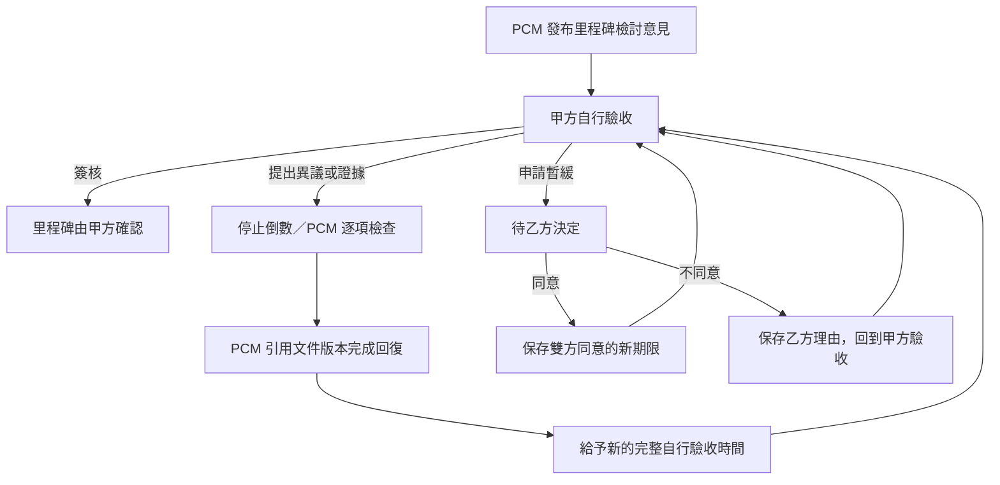

# PCM 里程碑驗證、終止與甲方自行驗收設計

日期：2026-07-30

狀態：Human 已核准產品規則，待法務確認契約文字後實作

適用範圍：PCM 獨立上線的甲方、受邀乙方與 PCM 工作台

## 1. 目的

本設計補足 PCM 施工里程碑中的兩條治理路徑：

1. PCM 發布里程碑檢討意見後，甲方有充分的自行驗收、提出異議與協議暫緩時間；只有甲方無理由、無證據、無暫緩申請且經補正通知 48 小時仍不簽核，才註記為甲方片面終止 PCM 服務。
2. PCM 因缺件或證據不足而不予驗收時，甲乙雙方仍可自主協議，由甲方在知悉 PCM 意見後自行同意該里程碑；PCM 原意見保持不變，PCM 服務繼續處理後續里程碑。

這兩條路徑都必須留下誰、何時、依據哪份文件、作成何種決定、目前狀態及下一步責任人的完整紀錄。

## 2. 核心邊界

- PCM 的檢討意見不是工程驗收、付款核准、法律裁判或品質保證。
- 甲方是工程驗收的最終決策者；乙方必須對其提交資料及自主協議內容明示確認。
- 「甲乙雙方私下協議」是指不由 PCM 主導的雙方自主協議，不是平台外無紀錄的口頭約定。要在 PCM 流程中生效，雙方必須在萊比確認同一份協議版本。
- 甲方自行同意驗收不得回寫或顯示成「PCM 通過」。
- 萊比不代收、託管或撥付甲乙方工程款，也不因任一狀態自動判定工程款已到期。
- 所有施工只發生在 A0 PCM 命名空間；8765 既有萊比頁面、路由及內容保持不變。

## 3. 甲方驗證與 48 小時終止狀態機

### 3.1 狀態

| 狀態 | 對外名稱 | 進入條件 | 下一責任人 |
|---|---|---|---|
| `OWNER_SELF_INSPECTION` | 甲方自行驗收中 | PCM 發布可供甲方查閱的檢討版本及引用文件 | 甲方 |
| `PCM_VERIFYING_OBJECTION` | PCM 檢查異議中 | 甲方提交具體異議、爭議範圍、理由或證據 | PCM |
| `OWNER_REINSPECTION` | 待甲方重新驗收 | PCM 完成逐項回復或發布修正版意見 | 甲方 |
| `DEFERRAL_CONSENT_PENDING` | 暫緩申請待乙方同意 | 甲方提出原因及新驗收日期 | 乙方 |
| `BILATERALLY_DEFERRED` | 雙方同意暫緩驗收 | 乙方明示同意同一申請版本及新期限 | 甲方、乙方 |
| `UNREASONED_NON_SIGNOFF_CURE` | 待甲方完成確認 | 自行驗收期限屆滿，仍無簽核、異議、證據或有效暫緩申請 | 甲方 |
| `PCM_SERVICE_TERMINATED_BY_OWNER` | PCM 服務已終止 | 補正通知送達滿 48 小時，重新檢查仍無合理回應 | 甲方、乙方 |

### 3.2 正常流程

每個里程碑都必須在甲乙方施工契約中設定 `owner_inspection_duration`；缺少此欄位時不得啟用該里程碑。甲方首次自行驗收的截止時間，從 PCM 檢討意見及完整引用文件送達後起算。PCM 回復異議後，甲方重新取得同樣長度的完整驗收期間，不沿用先前已消耗的時間。

### 3.3 48 小時補正程序

48 小時不是甲方唯一的自行驗收時間，而是自行驗收期限屆滿且甲方完全沒有合理回應後的最後補正期間。

補正倒數只能在以下條件全部成立時開始：

- PCM 的完整檢討版本、引用文件及附件均可由甲方正常讀取與下載。
- 原本的自行驗收期限已屆滿。
- 甲方沒有完成簽核。
- 甲方沒有提交具體異議、理由、證據或待處理的暫緩申請。
- 平台沒有影響甲方操作或文件存取的已知障礙。
- 正式補正通知已送達甲方；起算點採所有指定通知管道中最後可證明送達的時間。

補正期間為連續 48 小時。期間任何有效異議、證據或暫緩申請都會取消目前倒數，不得只暫停後沿用剩餘時間。

到期時系統必須在單一交易內重新檢查上述條件，避免甲方在最後一刻提交資料時仍被錯誤終止。到期動作必須可安全重試且只產生一次終止事件。

## 4. PCM 檢查異議的義務

甲方提交異議後，PCM 必須：

- 逐項列出甲方提出的問題與爭議範圍。
- 顯示引用的報價、施工圖、照片、協議或其他文件名稱及版次。
- 說明維持、修正或撤回原意見的理由。
- 對缺少的資料提出明確補件要求。
- 發布具版本識別的回復，不得無痕修改原意見。
- 回復後給甲方新的完整自行驗收時間，不得恢復舊倒數。

PCM 未完成逐項回復前，不得將案件送入終止程序，也不得把甲方異議標示成拒絕合作。

## 5. 甲乙雙方暫緩驗收

甲方可因現場安排、專業檢查、文件準備或其他時間因素提出暫緩申請，內容至少包括原因、影響範圍及建議的新驗收日期。

- 乙方必須明示同意；沉默不視為同意。
- 等待乙方決定期間不得觸發甲方片面終止。
- 乙方未決定時案件維持等待，不自動同意、不自動拒絕，也不恢復補正倒數。
- 乙方同意後，保存申請版本、同意人、同意時間及新的共同期限。
- 乙方不同意時必須說明理由，系統保存雙方說明並回到甲方驗收狀態。
- 暫緩協議內容如有修改，舊有雙方確認失效，必須重新確認新版本。

## 6. PCM 不予驗收時的甲方自行同意機制

### 6.1 觸發條件

當 PCM 的正式結果為 `SUPPLEMENT_REQUIRED` 或 `PCM_NOT_SUPPORTED` 時，甲方可以：

1. 依 PCM 建議要求乙方補件；或
2. 與乙方建立自主協議，再由甲方選擇自行同意驗收。

### 6.2 雙方協議要求

甲方自行同意前，必須先存在一份由甲乙雙方確認的協議版本，至少保存：

- 案件及里程碑。
- PCM 不予驗收意見的版本與摘要。
- 雙方決定不補或延後補充的項目。
- 雙方接受的例外、保留事項與後續責任。
- 引用的文件及精確版次。
- 甲乙雙方的確認身分、時間及確認證據。
- 協議內容的不可變識別值。

任何協議內容或引用文件異動，都會使既有確認失效。

### 6.3 甲方最終確認

協議經乙方確認後，甲方頁面顯示：

- PCM 為何不予驗收。
- 尚未補足的文件或現場證據。
- 甲乙雙方協議內容與文件版本。
- 「本決定為甲方自行驗收，不代表 PCM 改為通過」的清楚提示。

甲方完成強驗證及明示確認後，建立 `OWNER_OVERRIDE_ACCEPTANCE` 事件，里程碑對外狀態顯示為：

> 甲方依雙方協議自行驗收通過；PCM 意見仍為不予驗收。

### 6.4 核准效果

- 只影響本次里程碑，不終止或暫停 PCM 服務契約。
- PCM 繼續處理後續里程碑。
- 本期 PCM 服務已完成檢討工作，本期 PCM 服務費仍依原契約成立。
- PCM 原意見、缺件項目及風險提示持續可見且不可覆寫。
- 不自動判定乙方工程款到期；甲乙雙方依其施工契約自行處理。
- 後續發生爭議時，必須能由協議、文件、PCM 意見及雙方確認追溯完整決策過程。

## 7. 甲方片面終止的費用與契約效果

Human 核准的產品規則如下：

- PCM 與甲方在簽署服務契約時預先同意：本設計的補正條件成立時，視為甲方片面終止 PCM 服務，PCM 服務契約依約自動解除。
- 進入 `PCM_SERVICE_TERMINATED_BY_OWNER` 時，所有尚未發生的 PCM 服務費立即停止請款。
- 已支付的 10% PCM 簽約款，自動扣抵終止前 PCM 已提供的服務。
- PCM 與甲方同意 PCM 服務契約自動解除，不另行辦理退款，也不追加請款。
- 尚未送出的帳單不得建立；已排程但尚未成立的帳單必須取消。
- 終止只涉及 PCM 與甲方的服務契約，不代表工程驗收通過、甲乙方工程契約終止、工程付款到期、任一方違約或責任歸屬成立。

產品介面一律使用「PCM 服務終止」；契約應採「終止」或「解除」及其法律效果，由台灣法務依契約性質統一用語，但不得改變 Human 已核准的經濟效果。上述文字必須在 PCM 服務契約簽署前單獨揭露，保存甲方閱讀及確認證據。正式條款仍須服從法律強制規定，不得只以網站狀態取代契約約定。

## 8. 終止後的案件與資料權限

PCM 服務終止後，不刪除案件、不關閉甲乙方帳號，也不因終止設定固定 30 日後失去存取權。

### 8.1 甲乙方仍可使用

- 依原本案件權限讀取及下載文件、文件版本、留言、附件、確認、異議、PCM 回復及案件時間軸。
- 繼續記錄甲乙雙方的直接協議、工程爭議、附件及私下調停結果。
- 匯出各自依法及依權限可取得的案件資料包。
- 查看終止原因、契約版本、通知送達、倒數起訖及終止時間。

### 8.2 PCM 停止介入

- PCM 不再新增審查、意見、提醒、調停、補件要求或里程碑判定。
- 既有 PCM 意見及回復保持可讀且不可無痕修改。
- 一般 PCM 人員不得在終止後的甲乙直接討論中發言或建立治理任務。
- 終止後新增的甲乙直接討論由甲乙雙方依案件權限查看；PCM 不再是討論參與者。既有三方公開訊息仍按原權限保留。
- 依法令、資安、爭議保存或稽核所需的後台存取，必須另受權限及存取紀錄控制，不得被呈現為 PCM 繼續介入。

### 8.3 對外狀態

終止頁固定顯示：

> PCM 服務已停止介入。甲乙雙方後續改由直接協議；如有工程爭議，可另循雙方協議、民間調解、仲裁、訴訟或其他合法程序。本狀態不代表工程驗收、付款或責任歸屬已由萊比判定。

## 9. 三端頁面

### 9.1 甲方工作台

- 顯示目前狀態、驗收期限、下一責任人及完整倒數依據。
- 主要動作：「完成驗證並簽核」。
- 次要動作：「提出異議」、「申請暫緩驗收」。
- PCM 不予驗收時，增加「建立甲乙自主協議」及「依雙方協議自行同意驗收」。
- 自行同意頁必須先完整呈現 PCM 意見與協議內容，不能用單一確認框快速略過。

### 9.2 乙方工作台

- 顯示 PCM 補件項目及引用文件。
- 可補件並建立新文件版本。
- 可確認或拒絕暫緩申請，拒絕時必須填寫理由。
- 可確認甲乙自主協議的精確版本；不得代替甲方完成最終驗收。

### 9.3 PCM 工作台

- 增加異議佇列及逐項回復介面。
- 顯示甲方驗收、暫緩、補正倒數與自主協議狀態。
- 甲方自行同意後，PCM 意見保持原狀，案件進入下一里程碑。
- PCM 服務終止後，所有新增介入動作停用，只保留授權稽核讀取。

### 9.4 共用案件時間軸

至少記錄：

- PCM 發布意見。
- 甲方查看完整意見及文件。
- 甲方提出異議或證據。
- PCM 逐項回復或發布修正版。
- 暫緩申請、乙方決定及新期限。
- 補正通知送達及 48 小時起訖。
- 甲乙自主協議各版本及雙方確認。
- 甲方自行同意驗收。
- PCM 服務終止及未來請款取消。

## 10. 資料與事件介面

最小領域資料：

- `MilestoneReview`：PCM 意見版本、結果、引用文件、發布者、發布時間及該里程碑約定的甲方驗收期間。
- `OwnerObjection`：爭議項目、理由、證據、狀態及 PCM 回復。
- `InspectionDeferral`：申請原因、建議期限、乙方決定及共同期限。
- `NonSignoffCure`：通知版本、送達證據、起訖時間、取消或終止結果。
- `BilateralAcceptanceAgreement`：協議版本、文件引用、雙方確認與不可變識別值。
- `OwnerOverrideAcceptance`：甲方確認、協議版本、PCM 意見版本及風險確認。
- `PcmServiceTermination`：終止原因、契約版本、計費處理及資料權限快照。

正式事件名稱：

- `PCM_MILESTONE_REVIEW_PUBLISHED`
- `OWNER_OBJECTION_SUBMITTED`
- `PCM_OBJECTION_RESPONSE_PUBLISHED`
- `INSPECTION_DEFERRAL_REQUESTED`
- `INSPECTION_DEFERRAL_ACCEPTED`
- `INSPECTION_DEFERRAL_REJECTED`
- `NON_SIGNOFF_CURE_STARTED`
- `NON_SIGNOFF_CURE_CANCELLED`
- `BILATERAL_ACCEPTANCE_AGREEMENT_CONFIRMED`
- `OWNER_OVERRIDE_ACCEPTANCE`
- `PCM_SERVICE_TERMINATED_BY_OWNER`
- `FUTURE_PCM_INVOICES_CANCELLED`

所有命令需具備案件、里程碑、目前狀態、操作者、預期版本及冪等鍵。伺服端負責時間、到期判斷、權限及狀態轉換；瀏覽器倒數只作顯示。

## 11. 失敗與競態處理

- 通知未能證明送達時，不啟動 48 小時補正。
- 文件或平台無法正常存取時，取消補正倒數並留下原因。
- 甲方最後一刻提交異議與到期工作同時發生時，以同一案件狀態鎖定後判定，異議優先阻止終止。
- PCM 回復發布失敗時保持 `PCM_VERIFYING_OBJECTION`，不得誤回甲方驗收。
- 乙方確認過期協議版本時拒絕，要求重新載入最新版本。
- 終止交易必須同時停止未來請款及移除 PCM 介入能力；任一部分失敗則整體不得完成。
- 匯出暫時失敗不得影響資料仍可於平台讀取，並提供可理解的重試訊息。

## 12. 驗收標準

### 12.1 驗證與終止

- 正常自行驗收期間不顯示 48 小時終止倒數。
- 未設定甲方驗收期間的里程碑不能啟用；PCM 回復後重新給予相同長度的完整期間。
- 只有無合理回應且正式補正通知送達後才開始 48 小時。
- 異議、證據或暫緩申請會取消倒數。
- PCM 回復後給予新的完整自行驗收時間。
- 待乙方決定暫緩期間不會終止甲方 PCM 契約。
- 系統障礙、文件不可讀或通知未送達時不會終止。

### 12.2 甲方自行驗收

- 沒有雙方確認的同版協議時，甲方不能自行同意驗收。
- 協議或文件版本改變會使舊確認失效。
- 甲方完成後同時顯示「甲方自行驗收通過」與「PCM 不予驗收」。
- PCM 原意見內容及版本未被修改。
- PCM 服務繼續，後續里程碑仍可建立。
- 本期 PCM 服務費依約成立，但不自動判定乙方工程款到期。

### 12.3 終止後

- 所有未發生的 PCM 請款停止，10% 簽約款不退款且不追加請款。
- 甲乙雙方仍能登入、讀取、下載及匯出原權限資料。
- 甲乙可繼續記錄直接協議及爭議處理。
- PCM 不能新增意見、任務、提醒或調停紀錄。
- 歷史資料、訊息、附件及狀態不可無痕刪改。

### 12.4 介面與文案

- 桌機 1440×900 與手機 390×844 無水平溢出。
- 每頁均顯示目前狀態、下一責任人、截止時間及主要動作。
- 不出現工程語、金流託管、最低價保證、老屋投資或把 PCM 意見描述為法律裁判的文字。
- 錯誤、空狀態與尚未串接的功能使用可理解的繁體中文產品語言。

## 13. 上線前必要閘門

- 台灣法務確認 48 小時補正、自動解除、10% 扣抵、不退款與不追加請款條款。
- PCM 契約正文、附件、簽署確認項目、網站說明及狀態機使用同一版本規則。
- 正式通知送達、電子簽署與付款狀態使用伺服端可驗證資料。
- 資料保存與持續存取政策不得再使用「終止後固定 30 日即失去存取」的舊規則。
- 原 8765 donor 頁面與契約檔案雜湊保持不變；所有新行為只存在 PCM 複製版。
